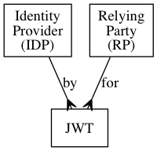
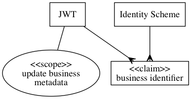
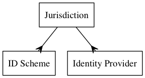
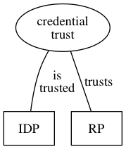
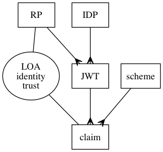

# IDP Concepts

This chapter explains concepts used in the ADBC IDP Specification.

While many of these concepts are common to other identity management
systems (such as SAML), terminology is not always used consistently
between communities. We aim for consistent language with the OpenID
Connect community, because ADBC IDP Specification is built on OpenID
Connect.

## Identity Services

The ADBC IDP Specification is an application of [OpenID
Connect](http://openid.net/connect/) (OIDC).

Under OIDC, an Identity Provider (IDP) is a service that has multiple
clients. These clients are called Relying Parties (RP). The IDP also has
multiple users, which can authenticate through the IDP and provide
authorisation (to RPs).

 * An IDP can have multiple clients
 * An RP can be a client of multiple IDPs
 * An IDP can have many Users

## Bearer Tokens

Identity service consumers are called "Relying Parties" because they
*rely on* services provided by the IDP. In practice this means the IDP
provides the RP with a token, which the RP can make use of.

OIDC provides a number of mechanisms for the RP to consume identity
service. ADBC IDP Specification only uses one of them, called a "bearer
token". The OIDC bearer tokens use the (JWT)\[<https://jwt.io/>\]
standard.

This means that the RP is issued a JWT by the IDP, and the RP relys on
that JWT for information about someone's identity, and to prove that
(acording to the IDP) the RP has the user's permission to do certain
things.

A JWT:

 * is issued by an IDP
 * is issued for an IDP's client (RP)
 * proves authentication by an identity (user)
 * proves the RP has been authorised by the identity to do some things

From the RP's perspective, something happens between a user and the IDP
(authentication of the user, and authorisation of the RP based on the
user's explicit concent) and as a result, the IDP creates a JWT and
provides it to the RP.

## Claims and Scopes

All OIDC tokens can be used by the RP as proof that (acording to the
IDP) they have some authorisation scopes and authentication claims by
the IDP.

A JWT can have:

 * multiple authorisation scopes (information about permission given to the RP)
 * multiple authentication claims (information about the identity of the user that gave permission).

The OIDC protocol contains some standard scopes and claims which must be
supported by all compliant IDPs, and also allows OIDC applications to
implement custom scopes and claims if they need to. The ADBC IDP
Specification makes used of custom scopes and claims, which ADBC IDP
Specification compliant IDPs must also support.

## Custom Claims and Scopes in the ADBC IDP domain

The ADBC IDP Specification aims to support an open market of identity
providers. This means there can be multiple Identity Schemes, where each
scheme is represented by a type of OIDC authentication claim for
different types of business identifier. Initially, the ADBC IDP
Specification defines an Australian Business Number (ABN) type of
identity claim, however other claims will be supported if compliant
Identity Providers can be found to service them.

The ADBC IDP Specification also adds a single aditional authorisation
scope ("update business metadata"). This scope is required for
orchestrating business message components.

For example, under the spec, a JWT may prove:

 * Authentication with a claim to represent ABN 12345678
 * Authorisation with scope of "update business metadata"

In this example the identity claim is against the "Australian Business
Number" ID Scheme (ABN). It means that (according to this IDP), this
client of the IDP (the RP) has permission to update businesses metadata
for the business known as ABN 12345678.

## ID Schemes and Jurisdictions

Anybody can invent their own business identifier scheme. The currency of
an ID Schemes in the identity market is exactly equal to the extent that
it proves useful.

Some ID Schemes have an official jurisdiction. For example, the ABN is
the legal business identifier in Australia. Other ID Schemes do not have
an official jurisdiction. For example, DUNS numbers are managed by a
company (Dun and Bradstreet). There is no need for a central authority
of identifier schemes (although multiple exist). The International
Standards Organisation provides a list of identifier schemes which are
potential candidates.

Where a Jurisdiction has an official ID Scheme, the head of power
(Government) of that jurisdiction may also provide services in the
identity market. For example in Australia, the Commonwealth owned
Australian Business Register operates an IDP service called VanGuard.

 * An ID Scheme may have zero or one Jurisdiction
 * A Jurisdiction may have zero or more ID Schemes (we would excect 1 to be the usual number)
 * A Jurisdiction may operate zero or more Identity Providers
 * An Identity Provider may be operated publicaly (by a Jurisdiction) or privately (by a person or company).

## Two kinds of trust

There are two kinds of trust that need to be taken into consideration by
a RP. They relate to the strength of the identity and of credentials.

  RP Trust type       Credential Strength                            Identity Strength
  ------------------- ---------------------------------------------- --------------------------------------
  What is trusted     The authentication token (JWT)                 Identity Claims within the JWT
  -----------------   --------------------------------------------   ------------------------------------
  Who is trusted      The Identity Provider (IDP)                    The authenticated business
  -----------------   --------------------------------------------   ------------------------------------
  RP Confidence       The token actually represents authentication   The IDP user is who they claim to be
  -----------------   --------------------------------------------   ------------------------------------
  How is it trusted   Totally (all or nothing)                       To a degree (level of assurance)

Credential strength is a partially subjective assessment of the IDP
itself, it relates to the RP's confidence that the IDP user (which the
IDP thinks is the business) did in fact authorise the token. Credential
strength is a measure of how confident an RP can be that the IDP's
customer actually issued the token. The RP either rejects or accepts a
JWT, Credential strength is an all or nothing proposition.

Assuming a JWT is accepted, how confident is the RP that the IDP's
customer is who they claim to be? Because a JWT can contain multiple
such identiy claims, this degree of trust is placed in each individual
claim, not the JWT itself. The ADBC IDP Specification is geared towards
business identities and relies on participation in regulated commerce as
it's source of identity strength. It defines different "Levels of
Assurance" (LOA) depending on the regulatory regime that underpins the
identity assurance.

## How an RP trusts an IDP

Consider these two hypothetical scenarios:

 * IDP-A uses a username/password credential for authenticating Australian businesses, where both the username and password are always easily guessable (single factor weak credential). It would be trivially easy easy to trick the IDP-A into issueing tokens that do not in fact represent authentication or authorisation of the business.
 * IDP-B requires a very long and complicated password and the presentation of a tamper-resistant hardware device in person to a physically secure locaton, where a full-body NMRI scan is performed (triple factor strong credentials). It is very difficult to trick IDP-B into issueing tokens that do not represent authentication and authorisation of the business.

An RP has to make their own assessment of the security of the IDP, based
on the IDP's systems and processes, and perhaps also their reputation.
An assessment of credential security is applied equally to every token
issued by the IDP.

Credential Strength is one area where IDPs differentiate and compete in
a trust market. <https://keybase.io/> is an example of a (non-OIDC)
identity service that competes on the strength of their credentials,
using blockchain-notarised cryptographic keys. This illustrates
credential strength differentiation in the trust market, however keybase
is geared towards individuals (not businesses identities) and relies on
aggregated evidence of participation in society as it's identity
strength (not Jurisdictional regulation).

## How an RP trusts a Token

The trust that an RP places in the identity of a token is applied to
individual claims, not to the token itself (or the IDP). Recall that a
tokens can have multiple claims, and within the ASBC IDP Specification,
each claim is associated an identity scheme, (which may belong to a
jurisdiction, etc).

Imagine four scenarios. In all of them, the IDP issued an token with two
authentication claims:

 * the about the ABN is 1234567
 * the DUNS number is 56789

In the first scenario, the IDP is operated by Dun and Bradstreet (who
administer DUNS numbers). In this situation, the RP might have:

 * Medium confidence in identity assurance the DUNS claim
 * Low confidence in the identity assurance of the ABN claim

In the second scenario, the IDP is operated by an Australian bank. Due
to anti money laundering and other KYC type regulations, the RP might
have:

 * High confidence in the ABN claim
 * Low confidence in the DUNS claim

In the third scenario, the IDP is operated by the Australian
Commonwealth (Government). The RP might have:

 * Very High confidence in the ABN claim
 * Low confidence in the DUNS claim

In the fourth scenario, the IDP is operated by a commercial organisation
with a contractual obligation to verify the identity of it's claims. The
RP might have:

 * Medium confidence in the ABN claim
 * Medium confidence in the DUNS claim

In words, that illustration says:

 * An IDP can issue many tokens (JWT)
 * An RP can be issued many tokens
 * Each token can have many claims
 * Each claim is associated with an identity scheme.
 * The RP has a certain amount of trust in the identity of the claim (called "Level of (identity) Assurance" or "LOA").

In the ADBC IDP Specification, Identity Strength of authentication
claims are measured in with 4 standardised Levels of Assurance (LOA),
ranging from low (self-asserted identity) through to very high
(Government identity services). A significant part of the specification
related to definition of these levels and how an RP can apply them.
	

## Authorisation and contractual proof of consent

The authorisation scopes attached to the JWT explicitly declare what the
token allows the RP to do.

OIDC supports multiple "Authorisation Flows", which are all based on the
concept that the RP is explicitly granted permission based on explicit
concent of the End-User, which is given in response to a request for
access by the RP. The ADBC IDP specification mandates that the OIDC
Authorisation Code Flow is supported (MUST be supported). Other OIDC
authorisation flows are alowed (MAY be supported).

Not all authorisation systems are based on consent. Other systems (such
as Role Based Control) are also common, and use rules (rather than
explicit consent by a human in response to a request) to determine what
authorisation is provided.

The ADBC IDP Specification extends OIDC with a special kind of
authorisation called "contractual proof of consent". This results in the
RP having a token that is like a JWT issued as part of an OIDC
Authorisation Code Flow, however the consent was granted by the End-User
before hand, not at the time of the request.

Contractual proof of consent tokens are necessary in the ADBC IDP
Specification because of the need to support machine-to-machine
integration, where each machine is operating on behalf of End-User
businesses in fully automated workflows. In these workflows, there is no
human to provide consent at the time of the interaction. Instead, the
End-User business makes a contract with the operator of the IDP,
explicitly giving them permission to grant authorisation tokens on their
behalf.

This is also described as a "Known Customer Relationship". A result of
the RP trusting the integrity of the IDP contractual proof of consent
process, is that the RP "knows" that the End-User business "is a
customer of" the IDP. Put another way, "known customer relationship"
trusts are implemented in the ADBC IDP Spec using the mechanism of
"contractual consent tokens", which are identical to OIDC Code
Authorisation Flow tokens from an systems integration perspective. The
fact that they are not generated in the usual way by the IDP does not
impact the RP, as long as the RP is willing to trust the IDP to do so.

## The "alias" relationship between identities

If a relying party obtains a token from an IDP that contain multiple
identity claims, this means the single token represents multiple
identifiers. The token does not represent a multitude of authorisations,
it represents a singular authorisation with multiple identifiers.
According to the token, these identifiers have an "alias" relationship
with each other. In other words, the business that provided
authorisation is "also known as" each of the identity claims.

Furthermore, a relying party can obtain authorisation tokens from
multiple identity providers. Tokens from different IDPs may contain a
different set of identity claims, or may contain equivalent claims at
different levels of assurance.

The relying party may make some reasonable inferences about alias
relationships between identifiers based on the set of concurrent claims
from multiple identity providers. If made, such inferences must be made
at equivalent LOA of the linked claim (inference must not be used to
escalate LOA).

For example:

 * If IDP-X issued a token with <ID-A@LOA-2> and <ID-B@LOA-2>; and
 * IDP-Y issued the same RP a token with <ID-B@LOA-1> and ID-C@LOA-1 ;
 * by transitive inference, the RP knows ID-A is an alias for ID-C
 * the LOA of this alias relationship is LOA-1 (the lesser of LOA-1 and LOA-2)

The other way to establish alias relationships between identities is a
mutual pair of assertions. For example, if ID-A asserted an alias
relationship with ID-B, and ID-B asserted an alias relationship with
ID-A. Either identity could break this alias relationship by revoking
their assertion.

Mutualy asserted alias relationships are made at the higher LOA of the
pair. For example:

 * If IDP-X issued a token for <ID-A@LOA-2>; and
 * This token was used to assert alias relationship with ID-C; and
 * IDP-Y issued a token for <ID-C@LOA-1>; and
 * that token was used to assert alias relationship with ID-A; then
 * by mutual assertion, ID-A is an alias for ID-C
 * the LOA of the alias relationship is LOA-2 (the greater of LOA-1 and LOA-2)

## The "on behalf of" relationship between identities

Authorisation scopes pertain to the authentication claims in a token. If
they trust the token at all (trust the IDP), then the RP will also trust
the identity claims in the token to the proscribed level of assurance.
Within those parameters, the Relying Party can be confident (and can
prove) that have permission to perform a certain type of action with the
consent of the End-User business.

But authenticated parties do not always act on their own behalf. There
are circumstances where one party (e.g. a professional service provider
such as a book keepter or other leger service) has the permission and
ability to make certain actions on the behalf of another business.

These role-based authorisations are not part of the ADBC IDP
Specification. They May be supported elseware, but not as part of this
spec. There is no need for specific OICD authorisation scopes or rules
to support this. If the ADBC Service Metadata Publisher specification
included role-based access control lists, then the existing
authorisation scope (update business metadata) would be sufficient to
allow maintenance of these access control lists.

## Business network relationships between identites

There are many other kinds of relationships between businesses, many
different complex webs of association. Some of them resemble social
media firends networks.

The ADBC IDP Specification does not attempt to capture or model these
relationship graphs. Like access control lists used to implement a
role-based security modelfor "on behalf of" relationships, it is
possible to capture association webs as business metadata. There is no
need to make any specific provision in the ADBC-IDP Specification to
support them.
