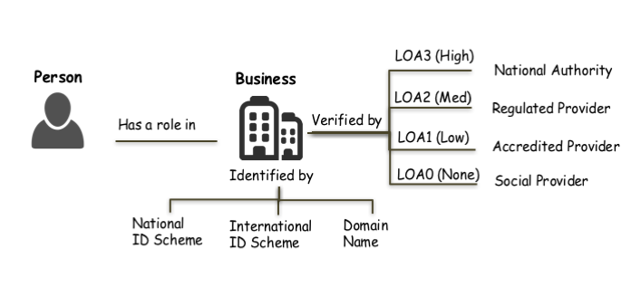

# Introduction

Integrity in the transacitonal network depends on business identity confidence.  Specifically that a person creating a transaction does have an authorised role in a business that is identified by a recognised scheme (eg Australian Business Number).  The framework can allow multiple assurance levels about an identity claim so long as the assurance level associated with any transaction is known to all parties.

The Open ID Connect (OIDC) specification is a very well established protcol for authentication and authorisation that meets the needs of the framework.  Therefore this specification builds upon OIDC by specifying a set of scopes, claims, and assurance levels that will support consistent use of a marketplace of identity providers.

## OIDC Definitions

* The Identity provider (IDP) is..
* The Replying Party (RP) is..
* The Resource Owner (RO) is..

## Assurance Levels

* LOA0 - no confidence in business identity (eg Social Auth)
* LOA1 - low confidence in business identity (eg an IDP such as a ledger package that has some basic known customer )
* LOA2 - medium confidence in business identity (eg an IDP like a bank that is subject to KYC regulation )
* LOA3 - high confidence in business identity (eg an IDP like VanGuard that is the registration authority itself)

## Claims

* ABN
* Domain Name
* DUNS
* what else?

## Scopes

* Publish Service Metadata
* what else?

