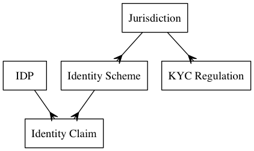

# Levels Of Assurance (LOA)

The IDP Concepts chapter describes level of assurance as the trust that
an RP places in the individual identity claims.

## Specified LOAs

A relying party places categorical trust in each identity claims that it
accepts from an IDP.

| LOA    | Confidence    | Definition                                      |
| ------ | ------------- | ----------------------------------------------- |
| 0      | Low           | Self-asserted identity                          |
| 1      | Moderate      | Unregulated community/organisation assurance    |
| 2      | High          | Regulated organisation assurance                |
| 3      | Very High     | Jurisdictional Assurance                        |

These categories are non-discretionary, meaning that if the relying
party accepts the token from the IDP, the LOA of the trust is determined
by rules that are part of the ADBC IDP Specification (not by policy of
the individual relying party).

## Logical Model

The following entity/relationship diagram illustrates the logical model
referenced in the rules that determine LOA. These terms are defined in
the IDP Concepts chapter.

In words, the logical model means:

 * An IDP can make many Identity Claims
 * All Identity Claims are associated with one Identity Scheme
 * An Identity Scheme may be associated with zero or one Jurisdiction
 * A Jurisdiction may have more than one Identity Scheme
 * A Jurisdiction may have more than one pieces of KYC regulation.

# LOA Rules

 * If an ID Scheme has no Jurisdiction, then a Relying Party MUST NOT trust ID Claims against that scheme above LOA-1. The maximum possible LOA for schemes without jurisdiction is LOA-1, LOA-0 is also possible for schemes without a jurisdiction.
 * If an IDP is not bound to KYC Regulation in the Jurisdiction of the ID Scheme, then a Relying Party MUST NOT trust ID Claims against that scheme from that IDP at LOA-2.
 * If an IDP is bound to KYC Regulation in the Jurisdiction of the ID Scheme, then a Relying Party MAY trust ID Claims against that scheme from that IDP at LOA-2.
 * If a Relying Party does not have a contractual relationship with an IDP assuring security cooperation in the event of incident or complaint, the relying party MUST NOT trust ID Claims from that IDP at LOA-2.
 * If an IDP is operated by the head of power (i.e. Government) in the Jurisdiction of the ID Scheme, then the Relying Party MUST trust Identity Claims against that scheme from that IDP at LOA-3.
 * A Relying Party may chose to reject claims from any IDP, including claims from an IDP operated by the head of power in the Jurisdiction of the Identity Scheme.
